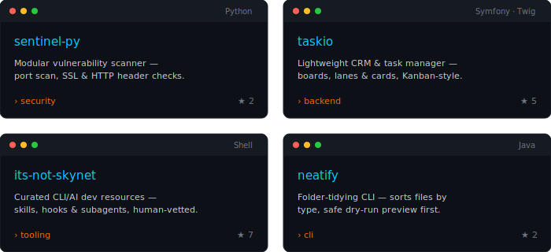

 

 

---

##  Stack & Identity

---

##  Featured Projects

<a href="https://github.com/Baylox/sentinel-py">sentinel-py</a> ·
<a href="https://github.com/Baylox/taskio">taskio</a> ·
<a href="https://github.com/Baylox/its-not-skynet">its-not-skynet</a> ·
<a href="https://github.com/Baylox/neatify">neatify</a>

---

##  GitHub Stats

<a href="https://github.com/DenverCoder1/github-readme-streak-stats">
  <picture>
    <source media="(prefers-color-scheme: dark)" srcset="https://streak-stats.demolab.com?user=Baylox&hide_border=true&background=0d1117&stroke=00cfff&ring=ff6a00&fire=ff6a00&currStreakLabel=00cfff&sideLabels=00cfff&dates=8b949e&currStreakNum=ffffff&sideNums=ffffff">
    <source media="(prefers-color-scheme: light)" srcset="https://streak-stats.demolab.com?user=Baylox&hide_border=true&background=ffffff&stroke=00cfff&ring=ff6a00&fire=ff6a00&currStreakLabel=0088bb&sideLabels=0088bb&dates=57606a&currStreakNum=24292f&sideNums=24292f">
    
  </picture>
</a>

 

*Feel free to explore my pinned repositories below.*

